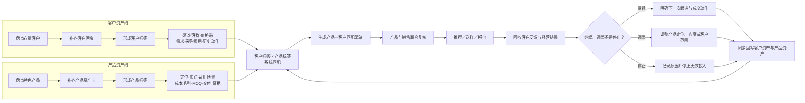

# 2026-07-20 每日AI复盘：让好产品主动找到对的客户

> 生成时间：2026-07-20 20:18（晚于17:30）  
> 状态：草稿/未提交  
> 事实边界：案例和判断来自用户当日复盘；涉及产品数量、客户数量、历史销量、毛利及转化数据均待确认。

## 可直接提交版

今天复盘产品开发时发现，特色产品当下销量不佳，不一定代表产品没有价值，也可能是原有客户画像限制了销售判断，而产品推荐又依赖个人记忆，导致好产品只能等客户偶然发现。真正的问题不是“产品没人要”，而是客户资产与产品资产没有被结构化、没有形成持续匹配机制。接下来要同时理清客户的渠道、客群、价格带和真实需求，也要理清产品的卖点、适用场景、成本毛利、MOQ、交付能力和销售证据，用“客户标签×产品标签”主动匹配、推荐并回写反馈，让好产品被看见，也让优质客户被持续经营。

## 经营判断

**销量差不等于产品差；如果一款产品只有在某个人“刚好想起来”或客户“刚好问到”时才被推荐，它就还没有成为公司可经营、可复用的产品资产。**

问题链路是：

`产品开发完成 → 缺少资产化标签 → 销售记不住/不会推荐 → 客户无法持续看到 → 无反馈与订单 → 被误判为产品不行`

## 两个方向

| 方向 | 要理清的核心内容 | 形成的经营结果 |
|---|---|---|
| 客户资产 | 客户渠道、目标消费者、价格带、产品偏好、采购周期、历史询盘/样品/报价、当前机会、最近动作、责任人 | 知道什么客户可能需要什么，而不是只在客户询价时响应 |
| 产品资产 | 产品定位、差异化卖点、适用客户/渠道、成本与毛利、MOQ、交期、合规/功效证据、样品状态、历史反馈、推荐话术 | 知道什么产品应该推荐给谁，以及为什么值得推荐 |

## 落地闭环

1. 先选1款有特色但销量不佳的产品试跑，补齐产品资产卡；具体产品待确认。
2. 按产品标签从存量客户中形成首批匹配名单，记录匹配理由、责任人、下一动作和反馈日期；客户范围与数据权限待确认。
3. 销售触达后必须回写“不需要的原因、需要调整的条件、送样/报价/成交结果”，由产品负责人每周复盘一次。
4. 根据真实反馈决定继续推荐、调整定位/方案或停止投入，不能仅用当前销量给产品下结论。

## 客户资产与产品资产匹配流程图

### 流程控制点

| 控制点 | 责任角色 | 必须输出 | 未通过处理 |
|---|---|---|---|
| 客户资产完整 | 销售负责人 | 客户标签、最近动作、责任人、下一机会 | 信息不足的不进入正式匹配 |
| 产品资产完整 | 产品负责人 | 产品标签、成本毛利、MOQ、交付与证据 | 信息不足的只补资料，不对外承诺 |
| 匹配复核 | 产品+销售 | 匹配理由、推荐方案、触达责任人 | 无明确理由的不批量推荐 |
| 反馈回写 | 销售+产品 | 送样、报价、拒绝原因、成交及调整建议 | 未回写的不视为动作完成 |
| 周期决策 | 业务负责人 | 继续、调整或停止结论 | 不以单次未成交直接判定产品失败 |

## 明日唯一重点

选定1款特色产品，完成产品资产卡，并形成首批“产品—客户”匹配清单；产品负责人、销售负责人、名单规模和完成时间待确认。

## 关联背景

- [业务痛点复盘与AI战略转型执行分析](../../11_张总分享专区/02_主题整理/2026-07-20_业务痛点复盘与AI战略转型执行分析.md)
- [每日AI复盘轻量执行SOP V1.1](../../06_经验与模板/SOP/每日AI复盘轻量执行SOP_V1.1.md)
