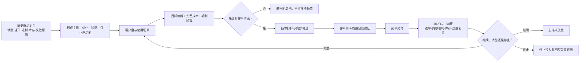

# 2026-07-22 每日经营思考：新品开发不是排产品，而是排经营验证顺序

> 生成时间：2026-07-22 20:49（晚于17:30）  
> 状态：草稿/未提交  
> 适用范围：内部经营讨论/产品决策会前材料  
> 数据边界：历史新品数据来自现有汇总材料，原始Excel、统计截止日、销量单位、返单定义及统一毛利公式尚未完成复核；涉及金额和毛利的结论均为待确认。

## 一、可直接提交版

今天汇总今年新品复盘和下半年开发方向后，我最大的思考是：新品开发不能再以“做出了多少款”为结果，而要以“是否有明确客户、是否接受价格、能否形成贡献毛利、能否返单”为结果。现有材料显示，38个新品中只有11个有返单，但贡献了96.4%的新品销量，贴片面膜又占全部新品销量的85.3%；虽然数据口径仍待复核，但已经足以说明资源应集中到少数被客户验证的方向。

下半年面膜开发应分成两条线：基础跑量款不急于继续加SKU，先把B5舒护面膜和三重胶原蛋白妆字号面膜的客户、订单、实际毛利、质量、库存及30/60/90天返单结果跟清楚；加强功效款则按“修复退红→即时美白→即时紧致”顺序推进，前一方向没有形成客户、价格、毛利和试单证据，后一方向不启动。

真正要改变的不是产品清单，而是开发机制：以后每个新品先回答“谁会买、在什么场景卖、能接受什么价格、公司能赚多少、失败后怎么停止”，再进入打样和投产。明日最重要的动作，是指定组合经营Owner，并由销售提交修复退红方向的目标客户、使用场景、价格反馈和试样/试单意愿，由产品、采购和财务同步完成成本及毛利预算。

## 二、经营结论

**下半年新品开发的核心，不是同时铺开更多功效，而是把有限资源按客户证据和经营结果排序。**

历史复盘反映出的不是“研发能力不足”，而是两种开发方式的结果差异：

- 围绕现有设备、现有客户和好卖产品迭代的项目，更容易产生销量和返单；
- 无目标客户、为完成开品数量、样品思维和主观市场测试的项目，大量没有形成持续订单。

因此，下半年应从“研发能做什么”切换为“客户需要什么、公司能赚什么、项目何时应该停止”。

## 三、数据完整性检查

| 指标 | 现有材料结果 | 可用于什么判断 | 使用限制 |
|---|---:|---|---|
| 新品SKU数 | 38 | 判断开发项目规模 | 原始Excel未取得 |
| 有返单SKU | 11，返单率28.9% | 判断商业验证项目占比 | 三级类目加总存在1个SKU差异；返单定义待确认 |
| 有返单SKU销量占比 | 96.4% | 判断结果高度集中 | 销量单位和统计截止日待确认 |
| 贴片面膜销量占比 | 85.3% | 支持其作为优先验证主线 | 仍需下钻客户、订单和利润 |
| 新品加权毛利率 | 较新材料测算19.1% | 提醒利润质量风险 | 与旧稿单品毛利存在明显冲突，必须待财务复核 |

结论：销量和返单数据可以支持“减少无客户开发、聚焦面膜主线”的方向判断，但暂不能据此直接定毛利目标、调价、设绩效或批准大规模投产。

## 四、下半年新品开发方向

### 1. 基础跑量款：先经营现有产品

| 产品 | 当前阶段 | 下半年重点 | 成功标准 |
|---|---|---|---|
| B5舒护面膜 | 已推出新品 | 跟踪客户、送样、报价、首单、返单、实际毛利、质量和库存 | 形成30/60/90天主推、优化、观察或停止结论 |
| 三重胶原蛋白妆字号面膜 | 投产准备 | 锁定投产/放行/出货节点，确认首批客户、报价、完整成本和毛利预算 | 完成首批交付并取得真实经营数据，不以投产完成代替成功 |

### 2. 加强功效款：按证据顺序推进

| 顺序 | 方向 | 启动前必须具备 | 进入下一阶段的标准 |
|---:|---|---|---|
| 1 | 修复退红 | 目标客户、使用场景、价格区间、成本与毛利预算、试样/试单意愿 | 客户体验、价格接受、质量合规和试单证据成立 |
| 2 | 即时美白 | 修复退红已形成阶段结论；即时体验与长期功效分开验证 | 客户、功效证据、合规路径和商业模型成立 |
| 3 | 即时紧致 | 即时美白已形成阶段结论；与现有胶原产品差异明确 | 客户愿意试单，定位不重复，利润与交付可行 |

管理要求：三个加强方向不得同时全面铺开；上一方向未通过阶段门，下一方向只保留机会研究，不进入正式打样、专用备料或排产。

## 五、经营闭环

## 六、当前风险

1. **口径风险：** 返单SKU数量和毛利数据存在冲突，若未经财务及订单底表复核就设目标，可能造成错误资源配置。
2. **客户风险：** 修复退红方向尚缺正式客户盘、强推客户及价格反馈，研发先行仍可能重演“产品做完没人买”。
3. **利润风险：** B5、三重胶原及加强款的完整成本、目标报价和贡献毛利预算未确认，可能出现销量增长但利润质量偏弱。
4. **资源风险：** 若三个功效方向并行，研发、测试、包材及销售注意力会被分散，失败项目难以及时退出。
5. **责任风险：** 面膜组合负责人和各项目唯一经营Owner尚未指定，容易形成多人参与、无人对客户和利润结果负责。

## 七、下一步动作

| 优先级 | 动作 | 责任角色 | 输出 | 时点 | 状态 |
|---|---|---|---|---|---|
| P0 | 指定面膜组合负责人和各项目唯一经营Owner | 管理层 | 书面责任及阶段决策权限 | 产品决策会前 | 待确认 |
| P0 | 统一销量、返单、收入及贡献毛利口径 | 销售运营＋财务＋采购 | 经确认的数据字典和复核数据 | 产品决策会前 | 待确认 |
| P0 | 建立B5与三重胶原经营跟踪表 | 产品Owner＋销售＋财务＋供应链 | 客户、订单、成本、毛利、质量、库存及30/60/90天节点 | 立即启动 | 待确认 |
| P0 | 提交修复退红方向客户盘及强推客户 | 销售负责人 | 客户、场景、价格、预计首单、试样/试单意愿、责任人和反馈日 | 正式立项前 | 待确认 |
| P1 | 完成修复退红成本和毛利预算 | 产品＋研发＋采购＋财务 | 完整成本、目标报价、单位毛利、投入上限及停止条件 | 正式打样前 | 待确认 |

## 八、需要老板确认

1. 是否批准下半年采用“基础款重经营、加强款按顺序验证”的两线策略。
2. 是否确认“无目标客户清单、无完整成本和毛利预算，不进入正式打样”的立项门禁。
3. 指定面膜组合负责人及各项目唯一经营Owner。
4. 是否先完成修复退红阶段验证，再决定即时美白和即时紧致的启动时间，避免三个方向并行投入。

## 九、明日唯一重点

由管理层确认面膜组合经营Owner，并完成修复退红方向首版客户盘：每个候选客户写清使用场景、可接受价格、试样/试单意愿、对应业务人员和反馈节点。

## 十、关联资料

- [2026年下半年面膜产品开发方向方案V3.0](../../09_产品开发管理/面膜类产品开发/2026年下半年面膜产品开发方向方案.md)
- [七遇产品价值跃升计划决策前置分析](../../09_产品开发管理/产品复盘/2026-07-22_七遇产品价值跃升计划_决策前置分析记录.md)
- [2026年上架新品产品开发复盘总结](../../09_产品开发管理/产品复盘/2026-07-13_2026年上架新品产品开发复盘总结.md)
- [面膜类产品开发与商业验证闭环SOP V1.0](../../09_产品开发管理/面膜类产品开发/面膜类产品开发与商业验证闭环SOP_V1.0.md)
