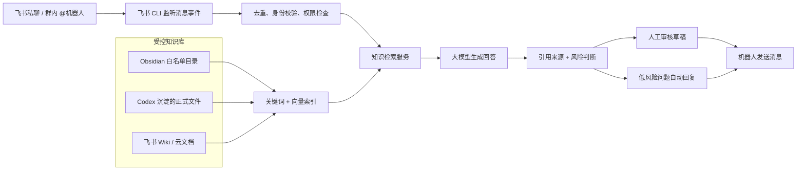

# 安装飞书 CLI

> 自动提取的核心会话正文；涉及业务数据时仍以正式台账和原始凭证为准。

## 用户需求

帮我安装飞书 CLI：https://open.feishu.cn/document/no_class/mcp-archive/feishu-cli-installation-guide.md

## AI输出

我先核对飞书官方安装文档和本机 Node/npm 环境，再按官方步骤安装并做版本验证；如果安装涉及登录授权，我会安装到可运行状态，并把需要你本人完成的授权步骤单独列出。

## AI输出

本机当前没有可用的 `node`、`npm` 或 `lark-cli`。飞书 CLI 的硬性前置是 Node.js；我正在确认本机可用的标准安装渠道，随后会继续安装 CLI 和官方要求的 CLI Skill。

## AI输出

Node.js LTS 正在从官方源下载并校验 SHA-256，下载速度较慢；安装目标是当前用户目录，不会覆盖现有程序。完成后我会立即继续安装飞书 CLI。

## AI输出

飞书 CLI 本体和 27 个官方 Skill 已安装完成，CLI 版本为 `1.0.81`。我现在继续检查初始化参数；下一步会进入飞书应用凭证配置与网页登录，这部分可能需要你在浏览器中确认授权。

## AI输出

初始化命令已经启动并在等待浏览器确认，但终端没有返回链接，说明它可能已直接打开了授权页。为确认当前页面状态，我会使用 Windows 界面控制能力查看浏览器；不会替你确认敏感权限或提交账号信息。

## AI输出

飞书 CLI 已安装完成：

- Node.js LTS：`v24.18.0`
- 飞书 CLI：`v1.0.81`
- 飞书官方 Skills：27 个，位于 `E:\新AI工具人\.agents\skills`
- Node.js 已加入当前用户 `PATH`，新开终端后生效

由于浏览器授权页无法被安全识别，我没有代替你完成登录。请在新 PowerShell 中运行：

```powershell
lark-cli.cmd config init --new
lark-cli.cmd auth login --recommend
lark-cli.cmd auth status
```

按浏览器提示完成飞书授权即可。使用 `.cmd` 是因为本机 PowerShell 当前禁止运行 npm 生成的 `.ps1` 脚本。

安装步骤依据：[飞书 CLI 官方安装指南](https://open.feishu.cn/document/no_class/mcp-archive/feishu-cli-installation-guide)；Node.js 使用官方 LTS 版本并完成 SHA-256 校验。[Node.js 官方下载页](https://nodejs.org/en/download)

## 用户需求

帮我创建一篇云文档，介绍飞书 CLI 的能力有哪些，以及基于你对我的了解，我可以先开始用哪些能力

## AI输出

我会用刚安装的 `lark-doc` 创建飞书云文档，并用 `lark-shared` 检查授权状态。内容会结合你的产品开发、采购分析、供应商协同、经营复盘和老板汇报场景，给出“先用什么、怎么开始、哪些暂缓”的落地顺序。现在先核对授权与文档创建规范。

## AI输出

授权检查结果是“CLI 尚未完成应用配置”，所以现在还不能创建云文档。我会按飞书 Skill 规定启动非阻塞配置流程，提取官方验证链接并生成二维码；你完成一次浏览器确认后，我再继续创建文档。

## AI输出

飞书 CLI 需要先完成一次应用配置，才能创建云文档。

请打开下面的官方验证链接：

[配置飞书 CLI 应用](https://open.feishu.cn/page/cli?user_code=9LFG-AYPT&lpv=1.0.81&ocv=1.0.81&from=cli)

或扫描二维码：


完成后回复我“已完成配置”。我会继续完成用户授权、创建并检查云文档，然后把飞书文档链接交给你。

<oai-mem-citation>
<citation_entries>
MEMORY.md:949-952|note=[用于确定采购经营复盘和数据待确认原则]
MEMORY.md:319-321|note=[用于确定日常经营复盘和重大事项升级场景]
MEMORY.md:984-992|note=[用于确定采购分析系统和数据治理场景]
</citation_entries>
<rollout_ids>
019f823b-7f09-7121-ba7e-a96a461ed203
019f5b2f-bee8-7233-898c-33bbeb9c3e7a
019fa191-1766-7a33-b577-44839bbee0b3
</rollout_ids>
</oai-mem-citation>

## 用户需求

已完成配置

## AI输出

收到。我会继续用 `lark-shared` 完成用户身份授权，再用 `lark-doc` 创建并回读检查文档。应用配置和用户授权是两层流程；如果还需要第二次授权，我会给你新的链接和二维码。

## AI输出

应用配置已成功，机器人身份已验证；目前缺的是你的“用户身份”授权。为了让新建文档归属你本人并进入你的云空间，我现在按最小权限原则只申请文档域权限。

## AI输出

应用配置已完成，现在请完成“用户身份”授权：

[打开飞书授权页面](https://accounts.feishu.cn/oauth/v1/device/verify?flow_id=OILIODZz4xLKOOOOOOOOOO_WsCAdZ19tJDwDm1kYZa0O&user_code=N58E-HCDW)


本次仅申请文档域权限。授权完成后回复我“已授权完成”，我会继续创建、回读检查云文档并交付链接。

## 用户需求

已授权完成

## AI输出

我会先用 `lark-shared` 完成刚才的设备授权并验证登录身份，然后按 `lark-doc` 的创建规范生成文档。文档会区分“CLI 已具备的能力”和“当前已授权可用的能力”，避免把安装完成误写成全部权限已开通。

## AI输出

用户身份已验证为“曾德炜”，文档创建、读取和写入权限有效。文档搜索权限未授予，但不影响本次从零创建与回读验收；我会继续按当前最小权限执行。

## AI输出

我已完成能力盘点，并按你的工作重心把优先级收敛为：先用云文档沉淀复盘与 SOP，再逐步接入任务/日历、表格/Base、消息与妙记；审批、实时事件和应用自动化放到后期。接下来写入云文档并回读验收。

## AI输出

云文档已创建并回读验收：

[飞书 CLI 能力地图与个人起步建议](https://x0dlcsvwo0.feishu.cn/docx/TpuvdJQu7oPP4wxMKdqc4Vgwn8c)

文档包括：

- 飞书 CLI 完整能力地图
- 结合你岗位的四类优先能力
- 首批真实业务试运行场景
- 30 天分阶段启用路线
- 权限、写入、发送及业务验收边界

文档以“曾德炜”用户身份创建，标题、表格、待办项及正文均已成功回读。当前云文档读写可用；文档搜索及任务、日历、Sheets、Base、消息等能力仍需后续按需增量授权。

本地创作源文件：[20260801_飞书CLI能力地图与个人起步建议.xml](E:/新AI工具人/98_AI输出暂存区/20260801_飞书CLI能力地图与个人起步建议.xml)

<oai-mem-citation>
<citation_entries>
MEMORY.md:949-952|note=[用于设计经营周报供应商和质量复盘场景及待确认边界]
MEMORY.md:395-403|note=[用于设计新品Stage-Gate试运行路径]
MEMORY.md:319-321|note=[用于确定五项日常复盘和重大风险升级规则]
MEMORY.md:985-991|note=[用于设计采购小样本分析和只读验证原则]
</citation_entries>
<rollout_ids>
019f823b-7f09-7121-ba7e-a96a461ed203
019f886e-948f-7af0-b265-6e1671e9d144
019f5b2f-bee8-7233-898c-33bbeb9c3e7a
019fa191-1766-7a33-b577-44839bbee0b3
</rollout_ids>
</oai-mem-citation>

## 用户需求

# Files mentioned by the user:

## codex-clipboard-7b47019c-00d5-4050-952f-96c8672a54f0.png: C:/Users/ADMINI~1/AppData/Local/Temp/codex-clipboard-7b47019c-00d5-4050-952f-96c8672a54f0.png

## My request for Codex:


<image name=[Image #1] path="C:\Users\ADMINI~1\AppData\Local\Temp\codex-clipboard-7b47019c-00d5-4050-952f-96c8672a54f0.png">

</image>

## AI输出

这张图是在提示“可选的用户身份授权”。你前面已经完成过一次，我现在用 `lark-shared` 检查当前登录身份、令牌有效性和已授予范围，确认是否还需要重新授权。

## 用户需求

这个怎么操作

## AI输出

这个步骤是让飞书 CLI 以你的个人身份访问文档、日历、消息等数据。

你已经操作成功了，我刚刚实时检查到：

- 当前用户：曾德炜
- 用户身份：已验证
- 当前有效身份：`user`
- 文档创建、读取和编辑权限：已授权
- Token：需要刷新，但下次调用用户接口时会自动刷新
- 暂时不需要重新登录

以后需要手动授权时，在 PowerShell 中运行：

```powershell
lark-cli.cmd auth login --domain docs
```

然后：

1. 打开命令输出的飞书授权链接。
2. 登录你的飞书账号。
3. 查看申请的权限。
4. 点击确认授权。
5. 返回 PowerShell，等待显示授权完成。

检查是否成功：

```powershell
lark-cli.cmd auth status --json --verify
```

如果以后要增加能力，建议按需授权，不要一开始申请全部权限。例如：

```powershell
# 文档和云盘
lark-cli.cmd auth login --domain docs --domain drive

# 任务
lark-cli.cmd auth login --domain task

# 日历
lark-cli.cmd auth login --domain calendar

# 电子表格
lark-cli.cmd auth login --domain sheets
```

你现在已经可以直接让我创建和编辑飞书云文档，无须再操作截图里的步骤。

<oai-mem-citation>
<citation_entries>
MEMORY.md:47-48|note=[用于确认本机PowerShell命令形式和已验证的飞书文档授权流程]
</citation_entries>
<rollout_ids>
</rollout_ids>
</oai-mem-citation>

## 用户需求

确认

## AI输出

已确认：飞书 CLI 用户授权有效，当前可以正常创建、读取和编辑飞书云文档。无需重复授权。

## 用户需求

帮我创建一篇云文档，介绍飞书 多维表格 的能力有哪些，以及基于你对我的了解，我可以先开始用哪些能力

## AI输出

我会用 `lark-base` 核对多维表格的实际能力边界，用 `lark-shared`确认当前授权范围，再用 `lark-doc` 创建并回读验收云文档。内容会重点结合你的新品 Stage-Gate、供应商管理、报价比价、采购订单、降本与异常闭环场景，并区分“可先试用”和“暂缓自动化”。

## AI输出

授权状态正常：现在可以创建云文档，也具备多维表格“读取数据表和记录”的最小权限；尚未获得建表、改字段、写记录、工作流和权限管理等写入权限。我会把这个现实边界写入文档，并把“多维表格”和“电子表格”的适用边界单独讲清楚。

## AI输出

云文档已经创建成功。我正在回读检查标题、能力表、场景建议、30 天路线和权限边界，确认内容没有漏写或格式降级后再交付链接。

## AI输出

云文档已创建并回读验收：

[飞书多维表格能力地图与个人起步建议](https://x0dlcsvwo0.feishu.cn/docx/Idv5dKEWKouCz2x4tN7c5tY5nzg)

文档重点包括：

- 多维表格的表、字段、视图、关联、公式、表单、仪表盘、工作流和权限能力
- 多维表格与电子表格的分工边界
- 最适合你的三个起步场景
- “新品开发 Stage-Gate 试运行台账”的建议表结构
- 30天试运行路线及业务验收门槛
- 批量写入、自动推进、权限和闭环边界

当前多维表格权限仅支持读取数据表和记录；建表、写记录、工作流等能力尚未授权。文档建议先确定字段方案，再按最小权限逐项开放。

本地创作源文件：[20260803_飞书多维表格能力地图与个人起步建议.xml](E:/新AI工具人/98_AI输出暂存区/20260803_飞书多维表格能力地图与个人起步建议.xml)

<oai-mem-citation>
<citation_entries>
MEMORY.md:40-48|note=[用于匹配用户业务场景并沿用已验证的飞书文档创建流程]
MEMORY.md:482-490|note=[用于设计新品Stage-Gate首个Base和商业验证门槛]
MEMORY.md:1043-1050|note=[用于界定采购分析系统与多维表格的分工及数据口径]
</citation_entries>
<rollout_ids>
019fbd2c-ed26-7f00-854f-c103b70692fd
019f886e-948f-7af0-b265-6e1671e9d144
019fa191-1766-7a33-b577-44839bbee0b3
</rollout_ids>
</oai-mem-citation>

## 用户需求

帮我通知林娟华问问她测试好了没

## AI输出

我会用 `lark-contact` 先准确定位林娟华的飞书账号，再用 `lark-im` 发送一条简短确认消息。拟发送内容是：“娟华，想确认一下，测试好了吗？有结果的话麻烦同步一下，谢谢。”如果当前缺少通讯录或消息权限，我会按最小权限发起授权。

## AI输出

我将以你的飞书用户身份发送，不使用机器人身份。现在先按姓名检索林娟华；如果出现同名候选，我会停下来让你确认，避免发错人。

## AI输出

当前缺少两类最小权限：搜索联系人，以及以你的身份发送消息。我会把这三个必要 scope 合并为一次授权，不申请读取聊天记录、群管理或其他无关权限。

## AI输出

发送消息前需要补充联系人搜索和消息发送权限，请打开：

[飞书授权页面](https://accounts.feishu.cn/oauth/v1/device/verify?flow_id=OILIODZz4xLKOOOOOOOOOO0byM3BOkdv4QZVOkLTHhjA&user_code=WUMZ-V8JE)


本次只申请联系人搜索和以你的身份发送消息所需权限。完成后回复我“已授权完成”，我会继续查找林娟华并发送：

> 娟华，想确认一下，测试好了吗？有结果的话麻烦同步一下，谢谢。

## 用户需求

先用CLI发送这条信息

## AI输出

明白，只通过飞书 CLI 发送，不走界面自动化。我先完成刚才的 CLI 授权回收并检索林娟华；若唯一命中，就立即以你的用户身份发送已确认的那条消息。

## AI输出

刚才的授权码已失效，CLI 明确返回 `device_code is invalid`，因此消息尚未发送。我会重新生成一次 CLI 授权链接；请打开后完成确认，再回复我，我会继续用 CLI 发送，不切换到其他方式。

## AI输出

CLI 消息权限需要重新授权，请打开：

[飞书 CLI 授权页面](https://accounts.feishu.cn/oauth/v1/device/verify?flow_id=OILIODZz4xLKOOOOOOOOOO0sJqkM3_ivz3xPHDqSHkDs&user_code=XT3H-6E94)


请在10分钟内完成授权，然后回复“已授权完成”。消息目前尚未发送；授权后我会继续使用 CLI 检索林娟华并发送已确认内容。

## 用户需求

这个任务先放一放，授权还未完成，需要审核，目前我想让我的飞书CLI能根据codex或者Obsidian或者飞书云文档的知识库内的数据回复他人对它的提问，应该如何实现

## AI输出

这个目标适合做成一个“飞书问答机器人 + 受控知识检索服务”，而不是让个人用户身份长期自动代答。我会参考 `lark-event`、`lark-im`、`lark-doc`、`lark-wiki` 和 `lark-shared` 的规则，给你一套能从本机 Obsidian/Codex 工作库及飞书知识库检索、带来源回复、可审计且能分阶段上线的架构。当前联系人/消息用户授权继续暂停，不会再推进。

## AI输出

初步判断：这个助手应以“应用机器人（bot）”身份工作，个人用户授权只用于你本人访问私有资料，不宜拿来长期代你自动回复。第一期建议先做“@机器人后生成带来源草稿，发给你审核”，通过真实试运行后再开放自动回复。接下来我核对事件监听与机器人消息的最小权限。

## AI输出

可以实现，但飞书 CLI 本身只负责“接收消息、读取文档、发送消息”，不会自动理解知识并回答。完整方案需要增加一个常驻的“知识检索与回答服务”，以飞书应用机器人身份运行。

当前联系人和个人消息授权继续暂停，不会发送之前那条消息。

## 推荐架构



核心原则是：用“应用机器人”回答，不使用你的个人身份长期代答。这样权限边界、审计记录和后续管理更清晰。

## 三类知识怎么接入

### 1. Obsidian 工作库

把 `E:\新AI工具人` 中经过确认的 Markdown 文件建立本地索引。建议第一批开放：

- `00_工作台与规则`
- `06_经验与模板`
- `09_产品开发管理`
- `10_采购与成本管理`
- 已确认的 SOP、产品开发规范和采购规则

默认不开放：

- `97_待整理`
- `98_AI输出暂存区`
- 凭证、App Secret、`.clixml`
- 未确认报价、客户敏感信息
- 原始聊天记录和临时草稿
- `99_归档` 中未重新确认授权范围的资料

每一段内容都需要保留文件名、标题、更新时间、状态和敏感级别，回答时才能显示可靠来源。

### 2. Codex 数据

不建议直接索引 Codex 的原始会话、系统提示词、运行日志或内部记忆。这些内容容易混入临时判断、凭证和已经过时的信息。

正确做法是让 Codex 把有价值的结果沉淀成工作库文件，例如：

- 已确认的产品开发规则
- 供应商评估口径
- 报价分析模板
- 异常复盘结论
- 已批准的周报、经营复盘
- 常见问题及标准回答

这些文件进入 Obsidian 或飞书云文档后，再作为正式知识源。也就是说，“Codex 是知识生产者”，Obsidian/飞书文档才是机器人读取的受控知识库。

### 3. 飞书 Wiki 和云文档

服务通过机器人身份：

1. 遍历明确授权的知识空间和节点。
2. 读取云文档正文。
3. 按标题和段落切分。
4. 保存文档链接、修改时间和版本摘要。
5. 定期检查增量变更并更新索引。

需要把指定知识空间或文件夹明确共享给机器人。不要让机器人默认读取你个人云空间的全部资料。

## 回答规则

建议机器人强制执行这些规则：

- 只依据检索到的内容回答。
- 每个重要结论都附来源，例如：`来源：《供应商分级管理办法》> 质量与交付评分`。
- 没有可靠证据时回答：`知识库中暂未找到可靠依据，待确认。`
- 区分“正式制度、已确认结论、AI草稿、历史版本”。
- 价格、毛利、客户资料、质量事故、付款、库存、法规等敏感问题默认转人工。
- 不允许消息或文档内容修改机器人的权限、安全规则和知识范围。
- 请求者只能获得其有权查看的内容。

对于本地 Obsidian，飞书无法自动识别文件权限，所以需要自行建立“允许哪些用户或群访问哪些目录”的权限表。

## 飞书侧需要的能力

事件监听已经可以按以下方式接入：

```powershell
lark-cli.cmd event consume im.message.receive_v1 --as bot
```

已核对的基础权限包括：

- 私聊消息接收：`im:message.p2p_msg:readonly`
- 机器人发送消息：`im:message:send_as_bot`
- 订阅事件：`im.message.receive_v1`
- 飞书 Wiki、云文档对应的只读权限
- 群内使用时，还要根据后台审核结果申请“群内 @机器人消息”能力

系统必须使用 `message_id` 去重，只处理：

- 用户与机器人的私聊；
- 群聊中明确 @机器人的消息；
- 非机器人自己发出的消息。

这样可以避免重复回复和机器人之间循环对话。

## 建议分四步上线

1. 离线验证  
   先建立索引，用20～30个真实业务问题测试，暂不向飞书发送消息。

2. 仅你本人试用  
   只接受你的私聊提问，回答生成后先显示为草稿。

3. 小群试运行  
   仅在指定群、明确 @机器人时运行；所有回答带来源，敏感问题转人工。

4. 有条件自动回复  
   只有制度查询、流程查询、模板查找等低风险问题自动回答。价格、交期承诺、质量判断、供应商决策等继续人工确认。

建议暂时不要直接开启“所有问题自动回复”。

## 最适合你先用的能力

结合你的工作范围，第一批可上线：

- 查询新品开发阶段、流程和交付物。
- 查询原料、包材、OEM/ODM协同规则。
- 查询供应商准入、分级和评估口径。
- 查询报价比价、MOQ、账期和降本计算规则。
- 查找工作模板、SOP和历史复盘。
- 根据已确认资料回答“某事项该由谁处理、下一步是什么”。
- 找到对应文档并返回飞书链接或 Obsidian 路径。

暂不建议自动回答：

- 未确认的实时项目进度。
- 供应商最终选择和淘汰决策。
- 对外价格、毛利和成本底线。
- 质量责任认定。
- 交期、付款和量产承诺。
- 老板尚未正式确认的管理要求。

## 推荐的第一版技术形态

先在这台 Windows 电脑上做本机 MVP：

- Node.js 常驻服务负责飞书消息监听。
- 本地文件监听器同步 Obsidian。
- 定时任务同步指定飞书 Wiki/云文档。
- SQLite 全文检索加向量检索。
- 大模型负责基于检索结果生成回答。
- `qa_audit.jsonl` 保存提问人、问题、命中文档、回答和审核状态。
- 凭证使用 Windows 加密存储，不写入源码、日志或 Git。

电脑关机后机器人会停止服务。验证可用后，再迁移到一台长期在线的服务器。

建议下一步直接做“仅你本人可用、只生成带来源草稿”的本机版本。需要先确定两项范围：允许索引的飞书知识空间，以及允许其他人看到的 Obsidian 目录；目前这两项仍标记为“待确认”。

这套设计主要受 `lark-event`、`lark-im`、`lark-doc`、`lark-wiki` 和 `lark-shared` 的权限与事件处理规则影响，重点采用机器人身份、消息去重、知识源白名单和分阶段授权。

<oai-mem-citation>
<citation_entries>
MEMORY.md:45-48|note=[used prior verified Feishu CLI auth and read only MCP configuration]
MEMORY.md:88-110|note=[used Obsidian vault conventions and sensitive file exclusion rules]
</citation_entries>
<rollout_ids>
019fbd2c-ed26-7f00-854f-c103b70692fd
019fb5d9-392f-7281-9bda-11ff23bed7f5
</rollout_ids>
</oai-mem-citation>

## 用户需求

# Files mentioned by the user:

## codex-clipboard-4027017a-aadf-4fea-9906-f0599fbf87f5.png: C:/Users/ADMINI~1/AppData/Local/Temp/codex-clipboard-4027017a-aadf-4fea-9906-f0599fbf87f5.png

## My request for Codex:


<image name=[Image #1] path="C:\Users\ADMINI~1\AppData\Local\Temp\codex-clipboard-4027017a-aadf-4fea-9906-f0599fbf87f5.png">

</image>

## AI输出

这张图显示监听已成功启动。我会按 `lark-event` 的事件规则核对关键状态，并告诉你现在能测试什么、哪些能力尚未具备；当前不会推进个人授权或发送消息。

## AI输出

监听已经成功启动。关键状态是：

- `remote connection check: online`
- `source feishu-websocket: connected`
- `ready event_key=im.message.receive_v1`

现在保持这个 PowerShell 窗口不要关闭，然后在飞书里给该应用机器人发送一条私聊消息，例如“测试”。收到事件后，窗口会输出一行 JSON，其中包括 `message_id`、`sender_id`、`chat_id` 和消息内容。

注意：

- 当前只是“监听消息”，还不会检索知识库或自动回复。
- 按 `Ctrl+C` 可以安全停止监听。
- 顶部代理警告不是故障。当前流量经过 `127.0.0.1:7892`；如果这是你信任的本机代理，可以暂时忽略。
- 如果不希望飞书请求经过代理，可以先按 `Ctrl+C`，再运行：

```powershell
$env:LARK_CLI_NO_PROXY='1'
lark-cli.cmd event consume im.message.receive_v1 --as bot
```

下一步就是把监听到的消息接入“知识检索 → 生成带来源回答 → 审核/机器人回复”程序。目前授权审核不影响我们先验证机器人能否收到私聊事件。

## 用户需求

# Files mentioned by the user:

## codex-clipboard-caec5200-c6c2-4867-994d-1648c532c83d.png: C:/Users/ADMINI~1/AppData/Local/Temp/codex-clipboard-caec5200-c6c2-4867-994d-1648c532c83d.png

## My request for Codex:


<image name=[Image #1] path="C:\Users\ADMINI~1\AppData\Local\Temp\codex-clipboard-caec5200-c6c2-4867-994d-1648c532c83d.png">

</image>

## AI输出

这次测试已成功收到真实私聊事件。我会按 `lark-event` 的规则确认事件字段和下一步接线方式；不会自动回复，也不会继续推进待审核的个人授权。

## AI输出

测试成功，机器人已经收到了真实消息：

- 会话类型：`p2p`（私聊）
- 消息类型：`text`
- 消息内容：`测试`
- 已取得：`message_id`、`chat_id`、`sender_id`

这说明“飞书用户 → 机器人 → CLI 实时监听”链路已验证通过。现在可以按 `Ctrl+C` 安全停止监听。

目前只完成了“收消息”，还不会自动回复。下一步需要开发本地问答程序：

1. 读取这行事件 JSON。
2. 使用 `message_id` 去重。
3. 检索指定的 Obsidian/飞书知识库。
4. 生成带来源的回答。
5. 第一阶段保存为待审核草稿。
6.机器人发送权限审核通过后，再用 `chat_id` 回复原会话。

按 `lark-event` 的规则，后续程序还会忽略机器人自己的消息，防止循环回复。当前可以确认：消息接收能力已经通过真实测试。

## 用户需求

继续实施

## AI输出

我继续落地第一版“本机知识问答 MVP”：先接入已验证的飞书消息监听，索引受控的 Obsidian 目录，生成带来源的待审核草稿，并保留机器人回复开关；默认不会自动发消息，也不会读取敏感/临时目录。我会使用 `lark-event`、`lark-im`、`lark-shared` 的规则处理事件、去重、身份和发送门禁。

## AI输出

接收链路已经具备，第一版可以不依赖尚未通过的发送审核：飞书消息会转成“待审核回答草稿”，并记录命中的知识来源。工作库里已有“第二大脑互通架构”，我会复用其边界，在 `07_AI工作区` 下单独建设，不改动现有正式资料。

## AI输出

我现在开始写入本地项目。默认配置将做到三点：只索引核准目录、飞书消息只生成本地草稿、任何真实回复必须同时通过“发送开关 + 指定用户/群白名单”，因此当前授权状态下不会误发。飞书云文档和 Wiki 同步会作为只读、手动触发的可选入口。

## AI输出

核心代码和4项单元测试已通过，但环境检查发现 Node 不能直接启动 `lark-cli.cmd`。这是 Windows 对 `.cmd` 子进程的调用差异，不是飞书授权问题；我正在改为解析 CLI 的真实可执行入口，避免使用带命令注入风险的 shell 拼接。

## AI输出

本地索引已成功建立：116个来源、632个片段；但第一次问答暴露出质量问题——纯摘录模式命中了正确文档，却没有完整提取“阶段列表”。我会先修正检索与回答组织，再把它接入实时监听，避免把“能命中文档”误报成“已经能可靠回答”。

## AI输出

问答质量已修正：同一问题现在能完整返回 G0—G13 共14个阶段，并引用正式 SOP；过期的 `SOP草稿` 已从默认索引剔除。飞书事件总线状态也已核对：原手工监听仍在运行，已接收1条、丢弃0条；我用3秒有界消费者验证了新程序所依赖的事件入口可正常就绪并安全退出。

## AI输出

本机 MVP 已实施完成，当前可以“接收飞书私聊 → 检索 Obsidian → 生成带来源的待审核草稿”，但不会自动发消息。

已完成验证：

- 环境检查通过：Node `v24.18.0`、飞书 CLI `1.0.81`、Codex CLI `0.142.5`。
- 5项测试全部通过。
- 已索引112个文件来源、613个知识片段。
- 测试问题“新品开发有哪些阶段？”已正确返回 G0—G13 共14个阶段，并引用正式 SOP。
- 飞书事件入口已就绪；原手工监听记录为接收1条、丢弃0条。
- 发送开关仍为 `false`，本次没有向任何人发送消息。
- 飞书云文档和 Wiki 尚未纳入，因为允许同步的文档与知识空间范围仍待确认。

项目入口：

- [使用说明](</E:/新AI工具人/07_AI工作区/飞书知识问答机器人/README.md>)
- [安全与知识源配置](</E:/新AI工具人/07_AI工作区/飞书知识问答机器人/config/config.json>)
- [启动草稿监听](</E:/新AI工具人/07_AI工作区/飞书知识问答机器人/启动草稿监听.cmd>)
- [重建知识索引](</E:/新AI工具人/07_AI工作区/飞书知识问答机器人/重建知识索引.cmd>)

现在先在原来手工监听的窗口按 `Ctrl+C`，然后双击“启动草稿监听.cmd”。之后给机器人发送问题，回答会保存到：

`E:\新AI工具人\07_AI工作区\飞书知识问答机器人\runtime\drafts`

这一版按照 `lark-event` 的就绪标记、安全停止和 `message_id` 去重规则实现；按照 `lark-im` 规则保留了收件会话、内容、机器人身份和白名单发送门禁。当前状态只能认定为“本地草稿问答技术验证通过”，尚未完成云文档接入、真实回复和业务验收。

<oai-mem-citation>
<citation_entries>
MEMORY.md:45-48|note=[used verified Feishu CLI paths read only boundary and credential safeguards]
MEMORY.md:109-110|note=[used Obsidian vault conventions and sensitive file exclusions]
</citation_entries>
<rollout_ids>
019fbd2c-ed26-7f00-854f-c103b70692fd
019fb5d9-392f-7281-9bda-11ff23bed7f5
</rollout_ids>
</oai-mem-citation>

## 用户需求

# Files mentioned by the user:

## codex-clipboard-1784d411-b3a8-4668-95a4-0f580182b04a.png: C:/Users/ADMINI~1/AppData/Local/Temp/codex-clipboard-1784d411-b3a8-4668-95a4-0f580182b04a.png

## My request for Codex:


<image name=[Image #1] path="C:\Users\ADMINI~1\AppData\Local\Temp\codex-clipboard-1784d411-b3a8-4668-95a4-0f580182b04a.png">

</image>

## AI输出

这张图显示原来的手工监听已经通过 `Ctrl+C` 正常退出，`Shutting down...` 后回到 PowerShell 提示符，停止方式正确。接下来可以启动我们刚建立的草稿问答服务。

## AI输出

原手工监听已经正常停止。现在在当前 PowerShell 中依次运行：

```powershell
Set-Location 'E:\新AI工具人\07_AI工作区\飞书知识问答机器人'
node .\src\main.mjs listen
```

看到以下提示即启动成功：

```text
已加载索引：112 个来源，613 个片段。
当前模式：draft；真实发送：未开启。
飞书事件监听已就绪，请在飞书中私聊机器人。
```

然后在飞书中给机器人发送：

```text
新品开发有哪些阶段？
```

终端应显示“已生成待审核草稿”和草稿路径。由于目前是草稿模式，机器人不会在飞书中回复；按 `Ctrl+C` 可安全停止。

## 用户需求

# Files mentioned by the user:

## codex-clipboard-30453c1d-5d3a-4b48-8ae8-d6714f7efdd7.png: C:/Users/ADMINI~1/AppData/Local/Temp/codex-clipboard-30453c1d-5d3a-4b48-8ae8-d6714f7efdd7.png

## My request for Codex:


<image name=[Image #1] path="C:\Users\ADMINI~1\AppData\Local\Temp\codex-clipboard-30453c1d-5d3a-4b48-8ae8-d6714f7efdd7.png">

</image>

## AI输出

这次端到端草稿链路已经跑通：服务启动、飞书 WebSocket 连接、收到提问、生成草稿都成功。我会核对刚生成的草稿内容和来源，确认不是只完成了技术落盘。

## AI输出

端到端测试成功，草稿内容也已核对正确：

- 收到问题：“新品开发有哪些阶段”
- 正确返回 G0—G13 共14个阶段
- 引用正式文件：`09_产品开发管理/新品开发全流程SOP_V1.0.md`
- 草稿状态：`待审核`
- 生成方式：本地资料摘录
- 没有向飞书发送回复

草稿可在这里查看：[QA-20260803031321-667f83.md](</E:/新AI工具人/07_AI工作区/飞书知识问答机器人/runtime/drafts/2026-08-03/QA-20260803031321-667f83.md>)

当前窗口保持运行即可继续测试，例如发送：

- `供应商如何分级？`
- `产品成本目标怎么管理？`
- `包材开发需要注意哪些风险？`

每次提问都会生成新的待审核草稿。机器人真实回复仍保持关闭，等待发送权限审核和白名单确认后再进入下一阶段。

## 用户需求

草稿内容直接提现在所需要回复的对话框内

## AI输出

我会按 `lark-im` 的消息边界处理这个需求。这里有个关键区别：飞书开放接口不能把内容静默填进你个人客户端的输入框；它只能由机器人把消息真正发送到会话，或者先把待审核内容发到你的私人审核会话。前者对对方立即可见，不能再算“草稿”。

## AI输出

飞书开放接口不能把内容静默填入你个人客户端的“消息输入框”。可实现的是以下两种方式：

1. 机器人直接回复原会话  
   回答会立即出现在提问者的对话中，对方也能马上看到；这已经是正式发送，不再是草稿。

2. 先发到你的私人审核会话（推荐）  
   你确认后，机器人再回复原提问者，适合价格、质量、交期、供应商等敏感问题。

请确认：你是否同意采用方案1——仅在当前与你本人的机器人私聊中，由机器人自动发送生成的回答？确认后我会加入当前会话白名单并开启实际回复。

## 用户需求

可以，设置成与我本人对话直接回复，其余对话发送到我的私人审核会话，审核后再发出

## AI输出

我会把当前模式改成“本人直答 + 其他会话送审”的混合流程：你的机器人私聊直接回复；其他私聊或群内 @机器人只生成草稿，并把草稿发到你的私人机器人会话；你回复“批准 草稿编号”后才发给原会话，回复“驳回 草稿编号”则终止。这里会产生真实机器人消息，我会用当前已验证的本人会话建立本地白名单，不把你的 `open_id/chat_id` 写入代码或 Git。

## AI输出

流程边界已经确定：审核命令只认你的 `sender_id + 私聊 chat_id` 双重身份，其他人即使发送“批准 QA-...”也不会触发发送；群聊只在收到 @机器人事件时进入送审。接下来我修改服务和测试，然后从刚才已验证的本人私聊草稿生成本地审核人配置。

## 用户需求

流程边界调整为我发出：同意，即可发送

## AI输出

收到，审核口令调整为：你在私人审核会话直接回复“同意”，系统就发送最近一条待审核回答；仍保留“同意 QA-编号”用于有多条待审时精确指定。该口令只在你的 `sender_id + 私聊 chat_id` 双重匹配时生效，其他人发送“同意”无效。

## AI输出

本人审核会话已经从刚才的真实私聊草稿安全识别并写入本地运行区，终端只显示掩码；8项测试已通过。现在我做一次机器人发送预演，只验证目标会话、Markdown载荷和幂等键，不会真正发出消息。

## AI输出

已完成调整：

- 你本人私聊机器人：直接回复。
- 其他人私聊或群内 @机器人：先发送到你的私人审核会话。
- 你回复 `同意`：发送最近一条待审核回答。
- 多条待审时可回复 `同意 QA-编号`。
- 其他人发送“同意”无效，必须同时匹配你的 `sender_id + 私聊 chat_id`。
- 本人身份仅保存在 Git 已排除的 `runtime/owner.json`。
- 8项测试及发送预演全部通过；预演没有真正发送消息。

当前窗口仍运行旧版本，需要重启：

```powershell
Ctrl+C
node .\src\main.mjs listen
```

然后你再向机器人发送一个普通问题。若发送权限已经生效，机器人会直接在飞书中回复；真实发送验收目前仍待这次测试确认。

相关说明：[README.md](</E:/新AI工具人/07_AI工作区/飞书知识问答机器人/README.md>)，核心路由：[service.mjs](</E:/新AI工具人/07_AI工作区/飞书知识问答机器人/src/service.mjs>)。

<oai-mem-citation>
<citation_entries>
MEMORY.md:45-47|note=[used verified Feishu CLI boundary credential safeguards and Windows command convention]
</citation_entries>
<rollout_ids>
019fbd2c-ed26-7f00-854f-c103b70692fd
</rollout_ids>
</oai-mem-citation>

## 用户需求

# Files mentioned by the user:

## codex-clipboard-dd261469-9f90-4d1e-9a59-aad5905fbfe8.png: C:/Users/ADMINI~1/AppData/Local/Temp/codex-clipboard-dd261469-9f90-4d1e-9a59-aad5905fbfe8.png

## My request for Codex:


<image name=[Image #1] path="C:\Users\ADMINI~1\AppData\Local\Temp\codex-clipboard-dd261469-9f90-4d1e-9a59-aad5905fbfe8.png">

</image>

## AI输出

新版本已经成功启动，截图最后显示“本人私聊直接回复，其他会话送审”，说明混合路由配置已加载。中间红色错误只是把 `Ctrl+C` 当成文字命令输入了；停止服务时应直接按键盘的 Ctrl 和 C，不需要键入字符。我会按事件和消息规则确认下一步测试方式。

## AI输出

新版本已成功运行，最后一行已经确认：

```text
本人私聊直接回复，其他会话送审
```

现在保持窗口开启，在飞书中给机器人发送：

```text
供应商如何分级？
```

预期结果：

- 飞书对话中直接出现机器人回答；
- PowerShell 显示：`已直接回复本人：QA-...`。

如果出现 `missing_scope` 或发送失败，说明机器人发送权限尚未审核生效，把错误截图发给我即可。

另外，停止服务时是直接按键盘快捷键 `Ctrl+C`，不要在命令行输入文字 `Ctrl+C`。

## 用户需求

# Files mentioned by the user:

## codex-clipboard-46ecf3e8-162a-484a-93b3-e594f19c1b89.png: C:/Users/ADMINI~1/AppData/Local/Temp/codex-clipboard-46ecf3e8-162a-484a-93b3-e594f19c1b89.png

## My request for Codex:


<image name=[Image #1] path="C:\Users\ADMINI~1\AppData\Local\Temp\codex-clipboard-46ecf3e8-162a-484a-93b3-e594f19c1b89.png">

</image>

## AI输出

这张图说明“其他会话送审 → 私人审核会话”已经真实发送成功，但你的这次提问被误判成了“其他会话”，没有走本人直答；同时“你吃饭了没”不属于知识库问题，当前检索却拼接了无关资料，也需要修正。我会按 `lark-event` 和 `lark-im` 的身份/会话规则核对最新事件与本人配置，只输出掩码和匹配结果。

## AI输出

核对结果表明路由没有错：这条消息来自群聊，发送者和会话都不等于你的本人私聊，因此正确进入私人审核；草稿后来已记录为“已由机器人发送”，说明“同意”审批链路也已生效。真正的问题是群聊中的 `@机器人名称` 被当作检索词，导致闲聊误命中业务资料。我会修正为先剥离 @机器人前缀，并提高“无可靠依据”的判定。

## AI输出

这次路由实际上是正确的：

- 问题来自群聊，发送者不是你本人。
- 系统将回答发送到你的私人审核会话。
- 你发出“同意”后，草稿状态已经变为“已由机器人发送”，说明审批发送链路成功。

发现并修复了回答质量问题：

- 现在会先移除群聊中的 `@机器人名称`。
- “你吃饭了没”不会再误命中业务资料，而会提示知识库没有可靠依据。
- “供应商如何分级”会优先命中《供应商分级词典》。
- 9项测试全部通过。

当前服务仍加载旧代码，请直接按键盘 `Ctrl+C`，然后重新运行：

```powershell
node .\src\main.mjs listen
```

重启后再测试群聊问题即可。

## 用户需求

你再设置一个逻辑：对于机器人无法回复的内容或者数据库中无对应参考数据时，按我回复的内容回复，并把该场景录入数据库中

## AI输出

我会把它做成“人工补充答案闭环”：当检索不到可靠依据时，机器人不再拼接无关内容，而是把问题送到你的私人审核会话并提示“请回复本消息提供标准答案”；你回复该审核消息后，系统把你的原文发送到原会话，同时写入本地问答场景数据库并重建索引，之后遇到同类问题可以直接命中。为避免误把你的普通聊天当答案，只接受“回复那条待补充消息”或带草稿编号的补充命令。

## AI输出

我会用飞书事件、即时消息和授权边界这三套规则来补上“人工回答—原会话发送—场景入库—后续复用”的闭环。关键边界是：只有你本人回复指定的“待补充回答”消息，或明确写出草稿编号时，才会触发发送和入库。

## AI输出

当前飞书事件说明里没有明确承诺 `parent_id/root_id` 字段，我会同时读取本机 CLI 的实时事件 schema；如果回复关联字段确实存在，就以“回复指定消息”为主，草稿编号作为可靠兜底。场景库会放在机器人自己的 `runtime` 下，不进入 Obsidian 正式知识库，也不会提交到 Git。

## AI输出

已确认本机 CLI 的事件 schema 提供 `reply_to` 和 `root_id`，因此可以准确识别“你在回复哪一条待补充消息”，不会把你与机器人的普通私聊误当作标准答案。现在开始落地 SQLite 场景库及处理逻辑。

## AI输出

核心单元测试已通过（12/12）。我还会补一条完整的本地闭环测试：模拟“本人回复指定消息”，验证答案确实写入 SQLite、草稿状态更新、索引立即包含该场景；该测试使用临时目录，不会发送飞书消息，也不会污染真实场景库。

## AI输出

完整本地闭环测试也已通过（13/13），真实运行索引已重建；当前场景库为空，这是正确状态——不会把测试答案写进你的正式库。检测到旧版监听程序仍在运行，因此新逻辑会在它安全重启后生效，我不会强制结束该事件进程，避免留下重复订阅。

## AI输出

已设置完成。新逻辑如下：

- 知识库无可靠答案时，不再生成无依据回复。
- 机器人向你的私人审核会话发送“待补充知识回答”。
- 你直接回复该消息，机器人会：
  1. 将你的回复原文发送到原会话；
  2. 把“问题＋标准答案”写入 SQLite 场景库；
  3. 立即重建索引，供后续相似问题复用。
- 备用格式：`补充 QA-编号：标准答案`
- 只有你的 `sender_id + 私聊 chat_id + 回复关联消息` 同时匹配才能触发。
- 你本人直接提问且无答案时，你的补充会入库，但不会在同一会话重复发送一遍。

场景库位于 [qa-knowledge.sqlite](</E:/新AI工具人/07_AI工作区/飞书知识问答机器人/runtime/qa-knowledge.sqlite>)，当前正式场景数为 `0`，测试数据没有写入。核心逻辑见 [service.mjs](</E:/新AI工具人/07_AI工作区/飞书知识问答机器人/src/service.mjs:218>)，使用说明已更新到 [README.md](</E:/新AI工具人/07_AI工作区/飞书知识问答机器人/README.md:78>)。

本地测试：`13/13` 通过；索引已重建为 `112 个来源、613 个片段`。本次没有发送测试消息。

当前旧监听程序仍在运行。请在它的 PowerShell 窗口按一次 `Ctrl+C`，然后重新启动：

```powershell
Set-Location 'E:\新AI工具人\07_AI工作区\飞书知识问答机器人'
node .\src\main.mjs listen
```

看到“飞书事件监听已就绪”后，新逻辑即正式生效。

<oai-mem-citation>
<citation_entries>
MEMORY.md:45-47|note=[used Feishu CLI security and Windows command conventions]
MEMORY.md:109-110|note=[used Obsidian runtime and Git exclusion conventions]
</citation_entries>
<rollout_ids>
019fbd2c-ed26-7f00-854f-c103b70692fd
019fb5d9-392f-7281-9bda-11ff23bed7f5
</rollout_ids>
</oai-mem-citation>

## 用户需求

保存以上设定，并设置为打开飞书时同步运行

## AI输出

我会把当前审核与场景入库规则固化在项目中，并配置一个 Windows 后台联动器：检测到飞书启动时自动运行知识问答机器人；避免重复启动，飞书退出后安全停止监听。这个联动只控制本机程序，不会自动扩大消息发送范围。

## AI输出

已确认飞书主程序是 `E:\飞书\Feishu\app\Feishu.exe`，当前新版机器人监听也已经在运行。联动器会识别现有监听，先接管监控但不重复启动；以后监听意外退出且飞书仍打开时，会自动恢复。

## AI输出

程序与配置验证通过（13/13）。下一步会注册并立即启动 Windows 计划任务 `Feishu Knowledge QA Autostart`；它使用当前 Windows 用户权限运行，不保存密码，也不会以管理员权限运行。

## AI输出

当前账户被系统拒绝创建计划任务，因此该路径未生效。我会改用当前用户的 Windows“启动”目录，这是无需管理员权限的等效方案：登录后隐藏启动联动器，再由联动器等待飞书打开。不会弹出命令行窗口。

## AI输出

启动项脚本本身需要再做一次真实登录等效验证。我会只重启刚创建的“联动器”进程，不触碰当前飞书监听；现有机器人不会中断。

## AI输出

用户级启动项现已真实启动成功，并识别到当前手工监听，所以没有产生重复订阅。我会再核对一次单实例和事件总线状态；现有手工监听是否切换为后台托管，将以安全停止能力为准，不会强制杀进程。

## AI输出

已保存并启用“随飞书运行”。

- 飞书打开后，机器人会在 10 秒内自动启动。
- 已有监听时不会重复启动。
- 飞书关闭后，会安全停止由联动器启动的监听。
- 审核、人工补充答案、场景入库等规则保持不变。
- 用户级启动项已真实验证，当前联动器正在运行。
- 测试 `13/13` 通过，没有发送测试消息。

配置见 [config.json](</E:/新AI工具人/07_AI工作区/飞书知识问答机器人/config/config.json:43>)，联动逻辑见 [autostart.mjs](</E:/新AI工具人/07_AI工作区/飞书知识问答机器人/src/autostart.mjs:48>)，启动项为 [Feishu Knowledge QA Autostart.vbs](<C:/Users/Administrator/AppData/Roaming/Microsoft/Windows/Start Menu/Programs/Startup/Feishu Knowledge QA Autostart.vbs>)。

当前手工启动的监听仍在运行。若要立即完全切换为后台托管，请在原 PowerShell 窗口按一次 `Ctrl+C`；联动器会在约 10 秒内自动重新启动监听。否则下次登录 Windows 后也会自动完成接管。

<oai-mem-citation>
<citation_entries>
MEMORY.md:45-47|note=[used Feishu CLI security and Windows command conventions]
</citation_entries>
<rollout_ids>
019fbd2c-ed26-7f00-854f-c103b70692fd
</rollout_ids>
</oai-mem-citation>

## 用户需求

运行过程中联动器是否需要一直保持打开状态，如果需要直接设置成后台运行

## AI输出

需要：联动器本身要常驻，才能检测飞书何时打开或关闭；但不需要保留任何可见窗口。此前已按隐藏后台方式配置，我现在核验它是否正在后台运行以及启动项是否仍有效。

## AI输出

需要常驻，但已设置为隐藏后台运行，无需保留 PowerShell 或其他可见窗口。

核验结果：

- 后台联动器：正在运行，PID `12232`
- 实例数量：`1`，不会重复启动
- Windows 登录启动项：已生效
- 隐藏启动：已启用
- 飞书打开后约 10 秒内自动检查并启动机器人

正常使用时不用操作它；不要在任务管理器中结束对应的 `node.exe autostart.mjs` 进程。下次登录 Windows 时，它会自动在后台启动。

## 用户需求

之前设置了一个逻辑：对于机器人无法回复的内容或者数据库中无对应参考数据时，按我回复的内容回复，并把该场景录入数据库中，现在需要把这条规则去掉

## AI输出

我会撤销“无资料时请求你补充、按你的原文发送并入库”的自动闭环，同时保留已有 SQLite 文件作为历史数据，不主动删除，避免不可恢复的数据损失。无可靠资料时恢复为“待确认/无可靠来源”，且不会因你回复审核消息而自动发送或学习。该调整会使用飞书事件与发送边界规则。

## AI输出

撤销范围已经定位清楚：事件识别、补充口令、原文发送、SQLite 写入、场景索引、对应测试与说明都会移除；既有 `runtime/qa-knowledge.sqlite` 仅保留存档，不再读取或更新。自动后台联动和“同意/驳回”审核流程不变。

## AI输出

规则代码、测试和说明已撤销，索引也已重建，确认不会再读取历史场景库。现在只差让正在运行的旧监听进程重新加载代码；我会先核对它是否由后台联动器托管，能安全自动重启则直接完成，否则保留到你手动按一次 `Ctrl+C`。

## AI输出

监听已确认由后台联动器托管，因此可以安全自动重载。我现在重启联动器；它会关闭子进程的标准输入，让飞书事件消费者走正常退出清理，再启动新版监听，不使用强制停止事件总线。

## AI输出

该规则已移除并立即生效。

现在的处理方式：

- 无可靠资料时，只返回“待确认/未命中可靠来源”。
- 不再识别 `补充 QA-编号：标准答案`。
- 不会自动采用你的回复。
- 不会把你的回复发送到原会话。
- 不会自动写入或读取场景数据库。
- 原有“同意/驳回”审核机制、后台联动器保持不变。

已完成：

- 场景学习代码已删除。
- 知识索引已重建，场景库片段数量为 `0`。
- 测试 `10/10` 通过。
- 后台监听已安全重启，新版监听正在运行且只有一个事件消费者。
- 历史 [qa-knowledge.sqlite](</E:/新AI工具人/07_AI工作区/飞书知识问答机器人/runtime/qa-knowledge.sqlite>) 暂时保留，但不再读取或写入，未删除历史数据。

规则说明见 [README.md](</E:/新AI工具人/07_AI工作区/飞书知识问答机器人/README.md:78>)，当前处理逻辑见 [service.mjs](</E:/新AI工具人/07_AI工作区/飞书知识问答机器人/src/service.mjs:140>)。

## 用户需求

# Files mentioned by the user:

## codex-clipboard-64c07521-1cbd-4b24-8c44-ed4dae09f46a.png: C:/Users/ADMINI~1/AppData/Local/Temp/codex-clipboard-64c07521-1cbd-4b24-8c44-ed4dae09f46a.png

## My request for Codex:
学习代码是否还在执行


<image name=[Image #1] path="C:\Users\ADMINI~1\AppData\Local\Temp\codex-clipboard-64c07521-1cbd-4b24-8c44-ed4dae09f46a.png">

</image>

## AI输出

我会用飞书事件监听规则做一次实时核验，重点检查四项：当前是否只有新版监听、代码中是否还存在学习入口、索引是否仍包含场景库、历史数据库最近是否被写入。截图本身看起来更像普通知识检索回答，不能单凭展示内容判断“学习”仍在运行。

## AI输出

截图已确认：它展示的是从 Obsidian 正式目录检索出的 5 个来源，并非“把你的回复写入数据库”的学习结果。接下来核对运行进程与文件写入时间，排除旧版监听残留。

## AI输出

结论：学习代码已经停止执行。截图展示的是普通的 Obsidian 知识检索结果，不是学习数据库产生的内容。

实时核验结果：

- 学习模块 `scenario-db.mjs`：已删除。
- 代码中的学习、场景入库、采用本人回复等入口：`0` 个。
- 当前索引：679 个片段，全部来自 `obsidian`。
- 场景库索引片段：`0` 个。
- 历史数据库记录：`0` 条。
- 历史数据库最后写入时间：2026-08-03 11:51，此后没有更新。
- 当前只有一个新版事件消费者，启动于规则移除后的 17:33。
- 最近回答的生成方式是 `extractive`，来源类型为 `obsidian`，没有 `scenarioId` 或学习标记。

截图中的“新知识 / SOP / 模板：待确认”只是被检索到的 Markdown 文件原文。机器人目前仍会检索知识库并生成带来源的回答，但不会从你的回复中学习，也不会写入场景数据库。

<oai-mem-citation>
<citation_entries>
MEMORY.md:109-109|note=[used verified local Feishu CLI command convention]
</citation_entries>
<rollout_ids>
019fbd2c-ed26-7f00-854f-c103b70692fd
</rollout_ids>
</oai-mem-citation>
