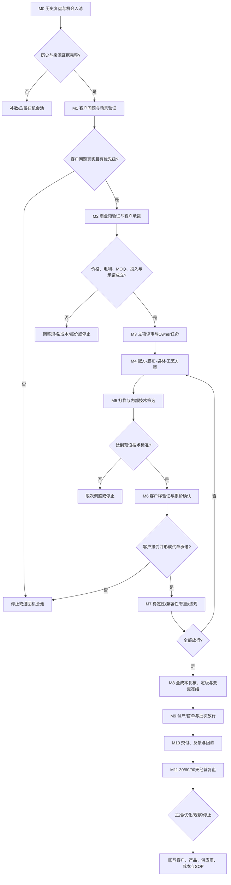

# 面膜类产品开发与商业验证闭环 SOP V1.0

> 文件编号：PD-SOP-MASK-001  
> 版本状态：**试运行版，待真实项目验收后正式发布**  
> 版本日期：2026-07-22  
> 适用主线：贴片面膜新品、老品升级、客户定制及利润改善项目  
> 扩展适用：水凝胶面膜、冻干面膜等特殊形态须增加专项技术、设备、质量与合规评审  
> 流程 Owner：产品开发负责人（姓名待管理层确认）  
> 单项目经营 Owner：每个项目必须唯一指定，不得以“多人负责”或“全公司协作”替代  
> 上位文件：[新品开发全流程 SOP V1.0](../新品开发全流程SOP_V1.0.md)  
> 执行台账：[面膜类产品开发 Stage-Gate 执行台账](./面膜类产品开发Stage-Gate执行台账.md)  
> 决策依据：[七遇产品价值跃升计划——决策前置分析记录](../产品复盘/2026-07-22_七遇产品价值跃升计划_决策前置分析记录.md)

## 1. 目的与经营结论

本 SOP 用于把面膜开发从“确定功效—研发打样—内部试用—生产备货”，调整为“客户问题—商业验证—立项—技术开发—质量合规—试单—返单复盘”的经营闭环。

面膜是现阶段有历史销量和返单证据的优先验证主线，但**品类有机会不等于具体项目可以直接立项**。每个面膜项目仍必须证明：

1. 客户为什么需要；
2. 客户接受什么价格和 MOQ；
3. 公司能否取得合理贡献毛利；
4. 膜布、精华、袋材、工艺、质量和合规是否可控；
5. 是否能形成付费打样、试单和返单；
6. 不成立时能否及时停止并控制库存、现金和研发投入。

本 SOP 不预设“即时效果—长效功效—冻干产品”的固定 12 周排期。每个项目通过前一阶段门后，才批准下一阶段的投入和时间表。

## 2. 适用范围与项目分类

### 2.1 适用范围

- 贴片面膜：本 SOP 的优先适用范围；
- 老面膜配方、膜布、袋材、规格、包装或报价升级；
- 有明确客户的定制面膜；
- 已有返单产品的成本、毛利、交付或质量改善；
- 水凝胶、冻干面膜等特殊形态：进入本流程前必须单独确认设备、工艺、专利/知识产权、测试、法规、MOQ和退出成本。

### 2.2 项目只允许选择一个主类型

| 项目类型 | 进入依据 | 核心验收 |
|---|---|---|
| 客户定制型 | 有具体客户、场景、价格或订单机会 | 客户书面确认、首单与返单 |
| 老品升级型 | 已有销量/返单，但存在功效体验、成本、质量或交付问题 | 原问题关闭，毛利或客户结果改善 |
| 标准方案型 | 多个客户存在相似需求，原包材可复用 | 可复制报价、客户验证和库存风险可控 |
| 技术储备型 | 明确战略批准及验证目标 | 投入上限、截止日期和技术结论；不得直接备货 |
| 特殊形态型 | 水凝胶、冻干等有客户证据及专项可行性 | 新增设备/工艺/合规/库存风险通过专项评审 |

## 3. 核心原则

1. **历史经营复盘先于品类排期。** 未完成收入/产值、毛利、返单、独家、失败原因和资源投入复盘，不批准组合性研发计划。
2. **客户问题先于产品方案。** 不能用成分热点、管理人员喜好或供应商推荐代替客户问题证据。
3. **商业预验证先于正式打样。** 目标采购价、完整成本、毛利、MOQ、首单量和客户承诺不足时，只能留在机会池。
4. **内部试用只作技术筛选。** 可判断使用感受、即时体验、配方初步稳定性及是否继续技术测试；不能证明客户需求、价格、毛利、订单和返单。
5. **先小单验证，后生产备货。** 未通过客户承诺、质量合规和经济模型门禁，不采购专用膜布、袋材或大货原料。
6. **每项目一名经营 Owner。** 对客户问题、产品方案、报价、毛利、验证和阶段结论负责。
7. **任何一关不满足即退回、暂停或停止。** 不得因研发、设计或采购已经投入而倒逼项目继续。
8. **试单不是成功，返单和贡献毛利才是经营验证。** 出货后必须完成 30/60/90 天复盘。

## 4. 流程总图

## 5. 角色与交付责任

| 角色 | 必须交付 | 签署/批准门禁 |
|---|---|---|
| 单项目经营 Owner | 商业假设、阶段计划、资源协调、风险升级、继续/停止建议、最终经营复盘 | M1—M11 全程；对阶段结论负责 |
| 销售/客户负责人 | 客户原话、场景、价格反馈、竞品、付费打样/试单/返单及回款证据 | M1、M2、M6、M10、M11 |
| 产品开发 | 产品定位、规格、卖点证据、版本管理、跨部门文件齐套 | M3—M8 |
| 研发/配方 | 配方方向、样品版本、原料资料、即时体验与长期测试计划、技术结论 | M4、M5、M7 |
| 采购/供应链 | 膜布、袋材、原料、OEM报价，MOQ、交期、账期、产能、替代供应和库存暴露 | M2、M4、M8、M9 |
| 财务/成本 | 含税/未税口径、全成本、毛利额/率、现金占用、预算及投入上限 | M2、M3、M8、M11 |
| 品控/法规/备案 | 测试计划、质量标准、兼容性、必要安全/功效证据、宣称/标签/备案路径及批次放行 | M3、M7、M8、M9 |
| 生产/OEM | 设备适配、工艺参数、试产、首件、过程记录、批次追溯、产能和交期 | M4、M9 |
| 设计/市场 | 图稿版本、产品方案卡、客户展示材料和卖点使用边界 | M6、M8、M10 |
| 管理层/批准人 | 战略方向、项目 Owner、预算上限、毛利红线、例外和重大停止损失 | M3及例外审批 |

多人可以协作，但每项交付必须落实到具体人员和截止日期。未确认姓名时统一标“待确认”，不得写“全公司负责”。

## 6. Stage-Gate 标准流程

### M0 历史经营复盘与机会入池

| 项目 | 标准 |
|---|---|
| 输入 | 过去半年新品明细、客户询盘/订单、销售反馈、供应商能力、老品问题 |
| 必做动作 | 按 SKU/客户/订单复盘产值或收入、贡献毛利、返单、独家性、失败原因、资源投入；区分已验证事实与待确认 |
| 输出 | 历史经营复盘表、客户问题池、供应链资源池、面膜机会清单 |
| 通过条件 | 数据来源、截止日、销量单位、返单定义、毛利公式明确；至少能追溯至客户/订单或明确战略来源 |
| 不通过 | 补数据；不得直接召开产品决策会或排研发周期 |

### M1 客户问题与场景验证

| 项目 | 标准 |
|---|---|
| 输入 | 面膜机会清单、客户资产、历史询盘/样品/订单/投诉/退货信息 |
| 必做动作 | 写清目标客户类型、销售渠道、价格带、目标消费者、使用场景、客户当前产品、问题原话、替代方案和购买周期 |
| 输出 | 客户问题卡、证据链接、客户优先级、客户负责人 |
| 通过条件 | 问题来自可识别客户或一组同类客户；有原始沟通、历史订单或其他可追溯证据；不是内部推测 |
| 不通过 | 退回机会池；不得以管理人员试用或供应商样品替代 |

### M2 商业预验证与客户承诺

| 项目 | 标准 |
|---|---|
| 输入 | 客户问题卡、概念方案、初步规格、供应链询价 |
| 必做动作 | 验证客户采购价区间、预计零售/渠道价、首单量、MOQ、初步全成本、毛利、交期、专用物料和付款条件；取得付费打样、试单意向或其他书面承诺 |
| 输出 | 商业预验证表、概念报价、客户承诺证据、投入上限和停止条件 |
| 通过条件 | 客户愿意进入下一步；价格区间和公司毛利逻辑成立；最坏库存/现金暴露在批准范围内 |
| 不通过 | 调整定位、规格、成本或 MOQ；仍不成立则停止 |

> 付费打样不是唯一允许形式，但替代证据必须由批准人确认，且不能仅是“客户说感兴趣”。

### M3 立项评审与项目组织

| 项目 | 标准 |
|---|---|
| 输入 | M0—M2 全部输出、初步风险清单 |
| 必做动作 | 明确项目类型、唯一经营 Owner、职能责任人、预算、时间、质量/合规路径、毛利门槛、打样上限和退出方案 |
| 输出 | 新品立项评审表、项目编号、RACI、阶段计划、批准记录 |
| 通过条件 | 客户、经济模型、责任、预算、阶段验收和停止条件齐全 |
| 不通过 | 退回 M1/M2、暂停或停止；不得进入正式配方和包材开发 |

### M4 面膜技术与供应链方案

| 模块 | 必须确认 |
|---|---|
| 精华配方 | 功效方向、肤感、黏度、气味、颜色、关键原料、资料、价格、交期、替代供应和宣称证据路径 |
| 膜布 | 材质、克重/厚度、尺寸、裁型、载液能力、贴合度、拉伸/变形、气味、供应商、MOQ和替代性 |
| 袋材 | 材质结构、阻隔性、印刷、尺寸、封口窗口、耐内容物、MOQ、交期、版费和通用性 |
| 灌装与工艺 | 单片标称量/控制范围、浸润方式、折叠、装袋、排气、热封、杀菌/洁净要求、设备适配和产能 |
| 质量合规 | 产品执行标准、测试项目、功效与宣称路径、标签/备案要求、风险物料和放行责任 |
| 经济模型 | BOM V0.x、样品与测试费用、试单 MOQ、量产阶梯成本、账期和库存退出 |

输出为《面膜技术与供应链可行性报告》、BOM V0.x、风险清单和样品评价标准。任何专用膜布、专版袋材或关键单一供应，必须有替代方案或经批准的风险承担。

### M5 打样、版本管理与内部技术筛选

每版样品必须唯一编号，至少关联：项目编号、配方版本、膜布批次/规格、袋材版本、灌装量、制作日期、制作方、样品数量、去向、原始反馈和下一版变化。

内部评价至少覆盖：

- 外观、气味、颜色、精华均匀性；
- 展开难度、膜布完整性、面部贴合与滑移；
- 即时肤感、刺激/不适反馈及使用后体验；
- 精华与膜布浸润、袋内残液、滴液情况；
- 袋材封口、渗漏和开启体验；
- 是否值得继续稳定性、兼容性及客户样验证。

通过条件必须在打样前写入项目评价标准。禁止只记录“好用、可以、效果明显”。内部试用不得直接得出客户需要、价格成立、可生产备货或功效宣称成立的结论。

### M6 客户样验证与报价确认

| 项目 | 要求 |
|---|---|
| 送样对象 | 必须来自 M1 已确认客户场景，禁止无目的群发 |
| 送样材料 | 样品版本、产品方案卡、体验指引、报价区间、MOQ、交期、反馈问题和使用边界 |
| 记录字段 | 客户、数量、寄出/签收日期、跟进人、计划反馈日、原始反馈、价格反馈、修改要求、下一动作 |
| 有效验证 | 接受报价/区间、愿意付费打样、确认试单、提供明确修改条件或书面停止原因 |
| 无效反馈 | 只有“不错、挺好、再看看”等无法形成决策的信息 |

未形成客户承诺的项目不得因内部评价好而进入定版或备货。客户修改导致配方、膜布、袋材、成本、宣称或交期变化时，必须退回对应阶段重新评审。

### M7 稳定性、兼容性、质量与法规验证

品控/法规须根据产品和市场路径形成书面测试计划，至少评估：

1. 配方本体的外观、气味、颜色、黏度等稳定性；
2. 精华—膜布—袋材—印刷/胶黏体系的兼容性；
3. 密封、渗漏、胀袋、运输及储存风险；
4. 微生物、安全、功效宣称及其他必要测试；
5. 标称量、尺寸、包装完整性和批次一致性；
6. 标签、宣称、备案/注册及客户市场所需资料。

具体方法、周期和接受标准必须写入项目质量标准，并由品控/法规批准；本 SOP 不编造统一阈值。任何必要项目未通过或证据缺失，不得定版、量产或对外承诺功效与上市日期。

### M8 全成本复核、定版与变更冻结

| 必备文件 | 内容 |
|---|---|
| 全成本表 | 配方、膜布、袋材、外盒/说明、加工、损耗、检测/备案、物流、税费、模具/版费、返工/退货风险及数量阶梯 |
| 毛利模型 | 客户价、含税/未税口径、单位毛利、贡献毛利、毛利率、账期和现金占用 |
| 定版资料 | 封样、BOM V1.0、配方/膜布/袋材/图稿版本、质量标准、工艺文件、报价版本 |
| 客户确认 | 产品、图稿、规格、数量、价格、交期和变更责任的书面确认 |

毛利必须采用经财务确认的统一公式。现有历史材料存在毛利口径冲突，未完成复核前不得以历史单一数值作为本项目审批标准。

定版后任何配方、膜布、袋材、供应商、灌装量、工艺、图稿、规格、数量、报价或交期变化，必须进入变更流程并重新评估客户、成本、测试、库存和交付影响。

### M9 试产/首单、检验与批次放行

试产或首单前必须确认：

- 客户订单或经批准的最小验证依据；
- 原包材齐套、批次和检验状态；
- 设备、产能、排产、工艺参数和首件标准；
- 灌装量、膜布折叠/装袋、热封、外观、标识和追溯要求；
- 过程抽检、成品检验、留样和异常处置；
- 客户交期、物流、付款/回款节点和失败物料退出方案。

未经品控放行不得出货。偏差放行必须记录批准人、风险、客户是否知情、追踪期限和关闭证据。

### M10 交付、客户反馈与回款

出货后记录批次、数量、签收、上架/使用、客户原始反馈、投诉/退货、回款节点、实际毛利和库存余额。质量、交期、价格或客户重大异常须立即进入专项闭环，不等待例会。

生产完成不等于收入实现，客户签收也不等于产品成功。

### M11 30/60/90 天经营复盘与资产回写

| 节点 | 必查 | 决策 |
|---|---|---|
| 30 天 | 首单交付、初销/使用反馈、质量、退货、回款、剩余库存、实际毛利 | 继续观察、问题关闭、暂停补货 |
| 60 天 | 返单/补货、报价转化、客户反馈、贡献毛利、库存周转、供应稳定 | 放量、优化、小单验证、停止 |
| 90 天 | 累计订单、返单、客户贡献、利润、质量、交付、库存损失和资源投入 | 主推、常规、机会池、淘汰/归档 |

复盘后必须同步：

- 客户资产：场景、价格带、偏好、反馈、购买周期、机会和下一动作；
- 产品资产：定位、适用客户、卖点证据、成本毛利、MOQ、交期、样品/量产状态和历史结果；
- 供应商档案：价格、质量、交付、配合、开发能力、资料和异常；
- 成本/报价库：最终 BOM、数量阶梯、实际损耗、报价和毛利；
- Stage-Gate 台账：阶段结论、继续/调整/停止和证据；
- SOP：实际执行偏差、需修订条款和版本建议。

## 7. 阶段决策与停止条件

### 7.1 统一阶段决策

| 决策 | 定义 | 允许动作 |
|---|---|---|
| 通过 | 当前阶段必备证据齐全且风险在批准范围内 | 进入下一阶段 |
| 有条件通过 | 仅有不影响下一阶段的小缺口，且责任人、期限、风险已批准 | 只执行批准范围内动作 |
| 退回 | 需求、方案、成本或技术可调整 | 返回指定阶段，不新增后续投入 |
| 暂停 | 等待客户、测试、资料或管理决策 | 停止新增投入，保护现有样品和资料 |
| 停止 | 商业、技术、质量、合规或风险条件不成立 | 执行项目退出和损失控制 |

### 7.2 必须暂停或停止的触发条件

- 无明确客户问题或证据来源；
- 客户不接受价格、MOQ、交期，且调整后仍无可行方案；
- 全成本或毛利低于公司批准门槛；
- 客户承诺取消或超过项目设定有效期；
- 打样次数、预算或周期达到立项时批准的上限；
- 稳定性、兼容性、质量、功效/宣称或合规风险无法关闭；
- 专用膜布、袋材、原料、模具/版费或现金占用超过批准上限；
- 单一供应、产能或交期风险不可接受且无替代方案；
- 试单发生重大质量、交付、退货或亏损问题；
- 市场、客户或公司战略变化导致原商业假设失效。

停止时必须盘点在库、在途、不可取消订单、已付款项、样品、版辊/模具、图稿、备案资料和客户承诺，明确损失、责任、消化方案、截止日期和关闭证据。

## 8. 异常升级机制

| 异常等级 | 触发 | 升级对象 | 必须输出 |
|---|---|---|---|
| P0 | 已影响客户安全/合规、重大质量、重大交付、负毛利或重大库存/现金风险 | 管理层＋经营 Owner＋相关负责人 | 立即止损、事实清单、影响范围、临时措施和决策需求 |
| P1 | 关键测试失败、客户拒绝、成本超标、关键物料延期或单一供应中断 | 经营 Owner＋职能负责人 | 原因、影响、纠正方案、责任人、期限和是否退回门禁 |
| P2 | 一般版本、资料、样品或计划偏差 | 项目例会 | 台账更新和关闭证据 |

异常未关闭前不得自动进入下一门禁。未经证据验证不得把推测写成根因。

## 9. 必填台账与记录要求

所有项目统一登记在[面膜类产品开发 Stage-Gate 执行台账](./面膜类产品开发Stage-Gate执行台账.md)，至少包含：

1. 项目主表与唯一经营 Owner；
2. 客户问题和商业验证；
3. 配方、膜布、袋材、工艺及供应链方案；
4. 样品版本、去向和原始反馈；
5. 测试、质量、法规及放行；
6. 成本、报价、毛利、MOQ和库存暴露；
7. 阶段评审、异常、变更和例外；
8. 试产/首单、交付和回款；
9. 30/60/90 天经营结果；
10. 停止退出和资产回写。

只记录真实发生的数据；缺少的客户、价格、数量、成本、日期、责任人、结论或证据统一标“待确认”。

## 10. 例会、验收与 SOP 闭环

| 机制 | 频率/触发 | 输出 |
|---|---|---|
| 项目推进会 | 每周或关键门禁前 | 当前阶段、卡点、责任人、截止日和阶段决策 |
| 阶段评审 | 进入下一门前 | 通过/有条件通过/退回/暂停/停止及证据 |
| 经营复盘 | 30/60/90 天 | 客户、毛利、返单、库存、质量、交付和回款结论 |
| SOP 验收 | 首个真实项目完成 90 天复盘后 | 保留、修改、删除条款及正式发布/继续试运行/停止决定 |

本 SOP 升级为正式发布版必须同时满足：

1. 至少 1 个真实贴片面膜项目从 M0 跑到 M11；
2. 客户、预算、样品、测试、试单、交付、回款和 30/60/90 天记录可追溯；
3. 完成至少一次跨部门验收，确认角色、时限、质量门槛和台账字段可执行；
4. 对流程偏差形成修订清单；
5. 管理层批准正式版本及流程 Owner。

在上述条件满足前，文件状态保持“试运行版”，不得宣称流程已形成真实经营闭环。

## 11. 试运行启动要求

| 顺序 | 动作 | 建议责任 | 验收标准 | 状态 |
|---|---|---|---|---|
| 1 | 指定 SOP 流程 Owner 与首个项目经营 Owner | 管理层 | 姓名、权限和职责书面确认 | 待确认 |
| 2 | 从历史返单面膜中筛选 1 个明确客户场景 | 经营 Owner＋销售＋产品开发 | 客户问题、价格、订单/询盘证据齐全 | 待确认 |
| 3 | 完成 M0—M2 前置评审 | 销售＋采购＋财务＋产品开发 | 商业预验证、投入上限和停止条件齐全 | 待确认 |
| 4 | 召开首个项目 M3 立项评审 | 经营 Owner＋各职能 | 形成通过/退回/暂停/停止决定 | 待确认 |
| 5 | 按台账执行并完成 30/60/90 天复盘 | 全体责任人 | 经营结果和资产回写有证据 | 待确认 |
| 6 | 验收 SOP 并决定正式发布或修订 | 管理层＋流程 Owner | 形成 V1.1/正式版或继续试运行结论 | 待确认 |

## 12. 版本记录

| 版本 | 日期 | 状态 | 变更说明 |
|---|---|---|---|
| V1.0 | 2026-07-22 | 试运行 | 基于历史新品复盘、七遇计划前置分析及通用新品 Stage-Gate，建立面膜客户验证、技术质量、试单返单和资产回写闭环 |

